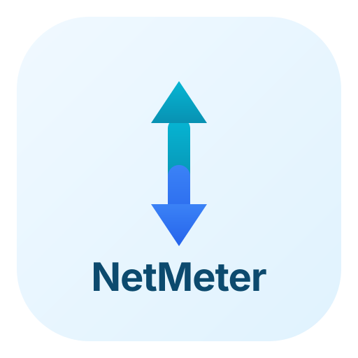

<p align="center">
  
</p>

<h1 align="center">NetMeter</h1>

<p align="center">
  <strong>macOS 菜单栏实时网速监控</strong><br>
  轻量、低功耗、零配置
</p>

<p align="center">
  
  
  
  
</p>

---

<p align="center">
  
</p>

在菜单栏显示**上行 / 下行**实时网速，基于内核接口字节计数器差分采样，CPU 占用极低，不影响电池续航。

## 特性

- **极低功耗** — 直接读取 `getifaddrs` 内核计数器，无需 `nettop` 等重型工具
- **自适应采样** — 无流量时自动降频，有流量时恢复高刷新率
- **双架构** — Universal Binary，原生支持 Apple Silicon (arm64) 和 Intel (x86_64)
- **菜单栏常驻** — 不占用 Dock 栏，不弹窗，安静运行

## 系统要求

- macOS 15.0 (Sequoia) 或更高版本
- Xcode（构建需要）

## 构建

```bash
# 克隆
git clone https://github.com/PrintNow/NetMeter.git
cd NetMeter

# Xcode 打开
open NetMeter.xcodeproj
# 选择 NetMeter scheme → ⌘R 运行
```

## 安装

从 [Releases](https://github.com/PrintNow/NetMeter/releases) 下载 `NetMeter-x.x.x.zip`，解压后：

```bash
# 移除隔离属性（未做 Apple 公证）
xattr -cr ~/Downloads/NetMeter.app

# 移动到 Applications
mv ~/Downloads/NetMeter.app /Applications/
```

> 也可以在 **系统设置 → 隐私与安全性** 中点击「仍要打开」。

## 许可证

[MIT](LICENSE)
